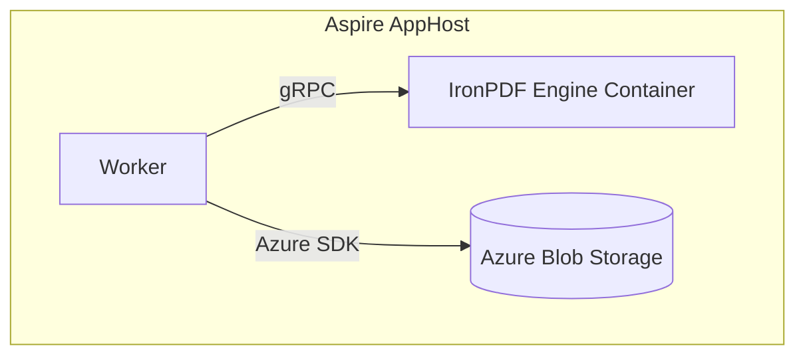
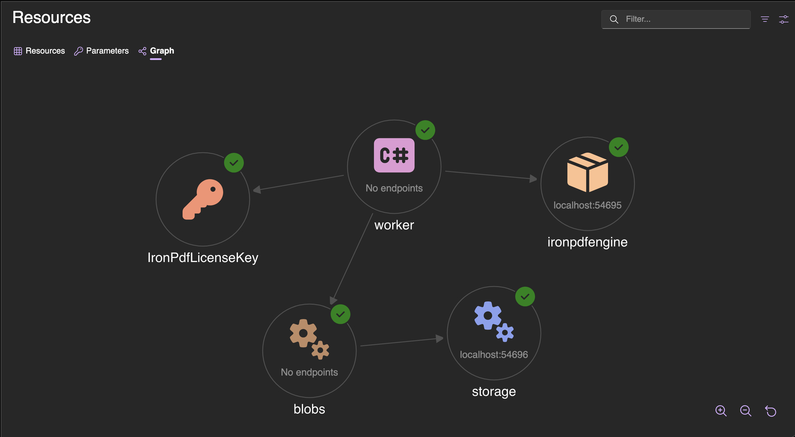
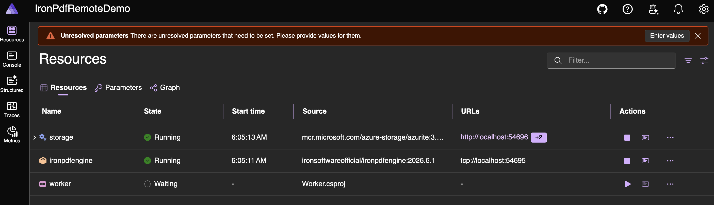
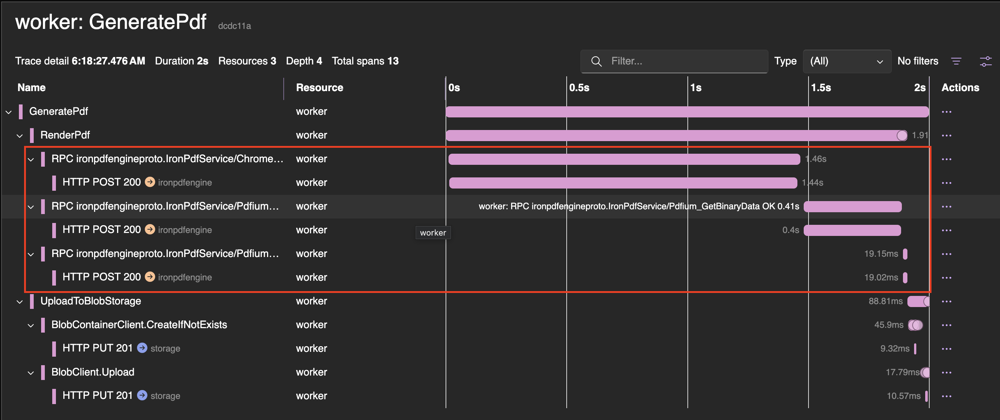

# IronPDF Remote Demo with Aspire

This repository serves as a reference and template demonstrating how to integrate a .NET application with **IronPDF** using their remote gRPC engine, IronPDF Engine. It uses **Aspire** for a streamlined local setup and to facilitate deploying a demo to Azure Container Apps.

## Motivation

IronPDF is a .NET PDF rendering library. It uses Chrome and PDFium to generate PDFs, requiring large platform-specific binaries to be included in the build of the application that installs the IronPDF package. This can substantially increase the size of build artifacts by hundreds of MBs and slow down the build process. It also requires several dependencies to be installed on the machine running the app. In addition to slowing down the development loop, this complicates cloud deployments, particularly in containerized environments.

The IronPDF docs list several workarounds for cloud deployments (see [Azure](https://ironpdf.com/get-started/azure) examples) and ways to deal with running in Linux by installing alternative package versions. 

They also provide an alternative of running the [IronPDF Engine](https://ironpdf.com/get-started/ironpdfengine-docker/) remotely to remove these dependencies from your application. Interacting with the remote engine involves installing the much smaller [IronPdf.Slim](https://www.nuget.org/packages/IronPdf.Slim/) package. This results in more streamlined build output and removes any concerns about installing additional dependencies or fonts, which can be beneficial even in non-containerized environments.

This app demonstrates how an app using the IronPdf.Slim NuGet package can connect to an instance of the IronPDF Engine to generate a PDF from HTML. It also considers using Azure Container Apps as the deployment target for Azure, while the IronPDF docs contain an example for deploying to Azure Container Instances.

## Architecture

The solution consists of the following components orchestrated by Aspire:

*   **`Worker` (.NET Background Service):** The application code that initiates PDF generation requests using the `ChromePdfRenderer` from the IronPDF SDK. It runs on a 5-minute loop and generates a PDF with the current timestamp and writes it to blob storage.
*   **`ironpdfengine` (Container):** The official IronPDF Engine container (`ironsoftwareofficial/ironpdfengine`) running as a sidecar/microservice. The worker communicates with this engine over a high-performance gRPC connection.
*   **Azure Blob Storage:** A storage container (`pdf-data`) used to persist the generated PDFs. In local development, this runs as an emulator. In production, it provisions an Azure Storage Account.





## Running Locally

### Prerequisites
*   [.NET 10 SDK](https://dotnet.microsoft.com/download)
*   [Aspire CLI](https://aspire.dev/get-started/install-cli/)
*   Docker (for running the IronPDF engine and Azurite emulator)
*   An IronPDF License Key

### Configuration
Configure your IronPDF license key as a user secret in the AppHost project by filling out the prompt in the Aspire Dashboard on first run.



Or use `dotnet user-secrets`:
```bash
dotnet user-secrets set "Parameters:IronPdfLicenseKey" "YOUR_LICENSE_KEY_HERE" --project IronPdfRemoteDemo.AppHost/IronPdfRemoteDemo.AppHost.csproj
```

### Running the App
Start the Aspire application locally from your IDE or the Aspire CLI:
```bash
aspire start --apphost ./IronPdfRemoteDemo.AppHost/IronPdfRemoteDemo.AppHost.csproj
```
The Aspire Dashboard will launch, showing the worker, the IronPDF engine, and the storage emulator. The worker will automatically generate a sample PDF and upload it to the emulated blob storage.

## Observability

Communication with the IronPDF Engine is over a gRPC connection. For better traces with OpenTelemetry, you need to add the [OpenTelemetry.Instrumentation.GrpcNetClient](https://www.nuget.org/packages/OpenTelemetry.Instrumentation.GrpcNetClient) instrumentation NuGet package. At the time of this writing, the package is currently in beta, so you need to enable pre-release packages.

This provides more detailed spans of the gRPC calls than just capturing that an HTTP call was made and ensures they are properly correlated with the related parent activity. 



## Production Readiness

### Resources

This app is configured for demo purposes and deploys the IronPDF Engine with default resources in ACA. IronPDF renders PDFs via an instance of Chromium, which can require more compute and memory resources. In a production environment, you might consider scaling that to a larger instance, horizontally scaling based on load or both. IronPDF's docs recommend [1 vCPU and 2 GiB of memory, or higher](https://ironpdf.com/get-started/ironpdfengine-docker/#:~:text=Size%3A%20Minimum%20of%201%20vCPU%20and%202%20GiB%20of%20memory%2C%20or%20higher).

The AppHost contains a commented-out section to illustrate how to configure the Azure Container Apps deployment container resources to those minimum values.

### Networking

The demo does not expose an external endpoint for the IronPDF Engine container, instead only allowing network traffic within the ACA environment. Communication is over cleartext HTTP/2 locally. If you host this in ACA and want to expose this outside the ACA environment, you need to ensure the Envoy proxy in ACA allows HTTP/2 traffic for gRPC.

## Deployment

This repository is configured to deploy a demo to **Azure Container Apps** using the Aspire CLI.

A **GitHub Actions** workflow ([`.github/workflows/deploy.yml`](.github/workflows/deploy.yml)) is included to automate the deployment process.

### Required GitHub Secrets & Variables
To deploy via the pipeline, configure an environment named `production` with the following:
*   **Secrets:** `AZURE_CLIENT_ID`, `AZURE_TENANT_ID`, `AZURE_SUBSCRIPTION_ID`, `IRON_PDF_LICENSE_KEY`
*   **Variables:** `AZURE_LOCATION`, `AZURE_RESOURCE_GROUP`
